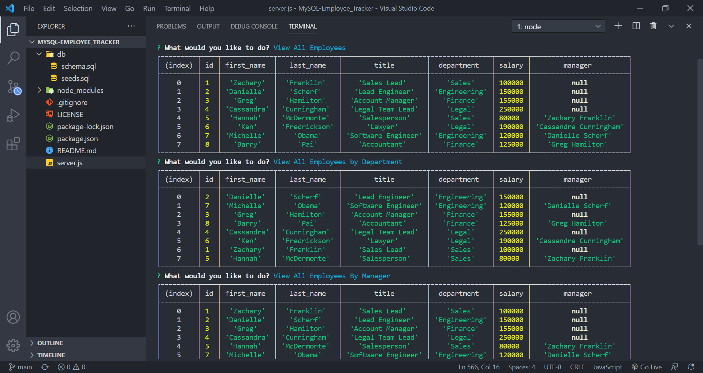
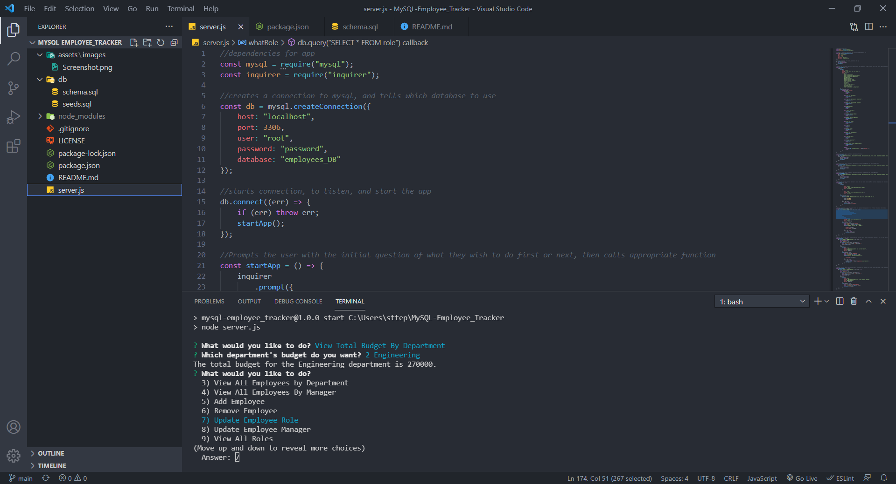

# MySQL-Employee_Tracker

---
## Descriptions
---

I created this app to allow business owners the ability to view and manage their departments, roles, and employees in their company to help with organization and planning for their business. This app does everything for the owner, and all they have to do is answer questions. Based on their choices and answers they will be able to view their departments, roles, employees/employees by department/employees by manager, the total utilized budget of a department, or add/remove/update any department, role, or employee. I learned how quickly a simple change can be when you have the foundational functions done for you. A business owner can easily update their tables instead of having to scroll to find a particular department, role, or employee and then make the changes. 
## Repository
---
[Application Repository URL](https://github.com/cmcunningham27/MySQL-Employee_Tracker)
## Table of Contents
---
- [Installation](#installation)
- [Usage](#usage)
- [License](#license)
- [Complications](#complications)
- [Features](#features)
- [Questions](#questions)
## Installation
---
1. Clone the repository in terminal
2. Run "npm i" in terminal
3. Run "node server.js" or "npm start" in terminal
4. You will be prompted with choices and questions. The app is working!
## Usage
---
[Demonstration Video](https://drive.google.com/file/d/1OLk0wcnwWe39vT8kUodMGEwwfP-Mew5g/view)
1. Once the app has begun scroll down the list and find Add Department, then press the enter button on your keyboard.
2. You will then enter the Department name and press the enter key again. 
3. Repeat steps 1-2 for each department in your business.
4. Now scroll down and find Add Role, and enter the role's name and the salary that goes with it for each role in your business.
5. Now you can scroll to Add Employee and add all your employees into the app, their role, and their manager.
6. When you choose to View Employees, Roles, or Departments you will be prompted with choices of which ones you would like to see.
7. In order to remove a Department, Role, or Employee scroll down the list and choose which one you would like to remove.
8. As Departments, Roles, and/or Employees are changing you will want to update the information. Scroll to the Update option that applies to the change and make the updates.
9. If you would like to see the total utilized budget for a specific department in your business you can scroll to View Total Budget By Department and choose which department you would like to view.
## License
---
This project is licensed under the MIT license.

## Complications
---
Getting started was hard at first because I was trying to work on the function for viewing all employees, but I did not have any values in the tables to utilize. Once I realized that I needed to include fake deparments, roles, and employees it began to fall into place. 

Creating the correct SELECT by JOINING all three tables was difficult at first. It took a lot of researching, but I finally found that some of the column names needed to be set AS what they were and that I then could use those names when joining the tables. This is something I will need to continue using in the future to strengthen this skill.

In one function I had placed the inquirer in the wrong location and couldn't figure out why an array was coming back undefined. I tried to get some help, and the person was unable to help me figure it out. I decided to try to move in in the first db.query right after the err part and this solved the problem. 
## Features
---
In the future I would like to include an extra option where the business owner can view a specific employee, and the option to View the Total Utilized Budget for the Whole Company.
## Questions
---
[GitHub Profile](https://github.com/cmcunningham27)

[E-mail](mailto:sttepstutoring@yahoo.com)

E-mailing me is the best option
